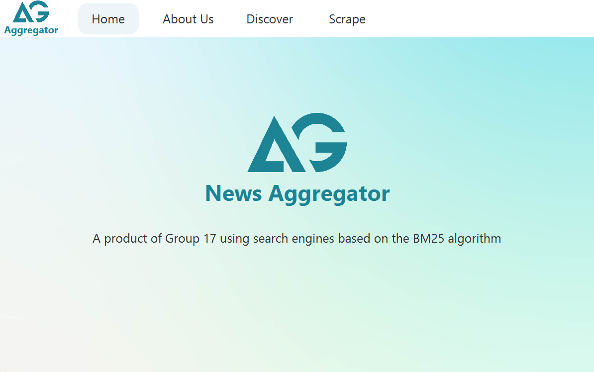
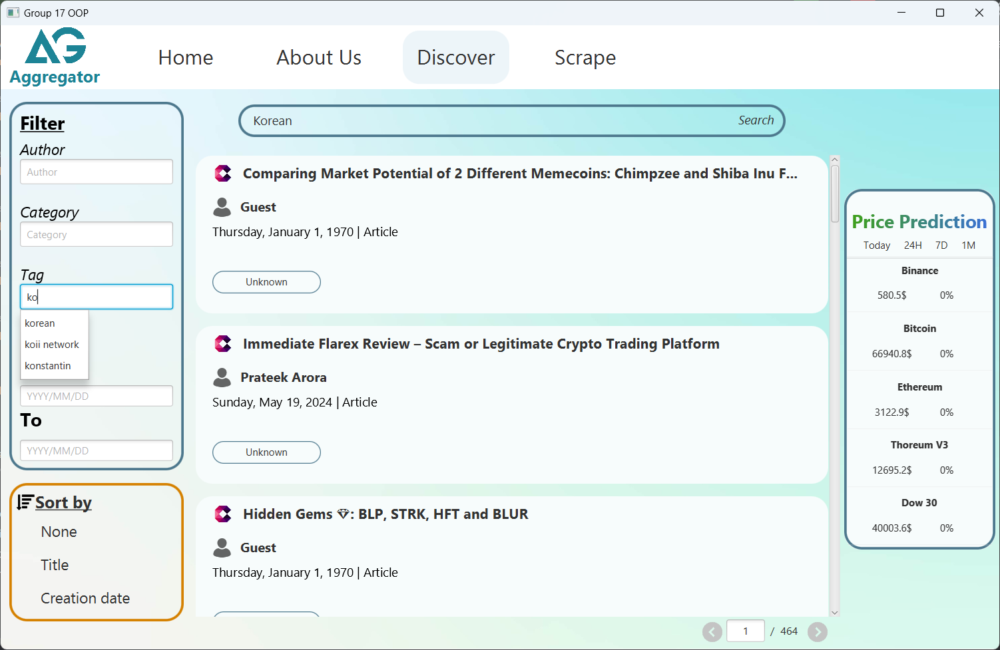
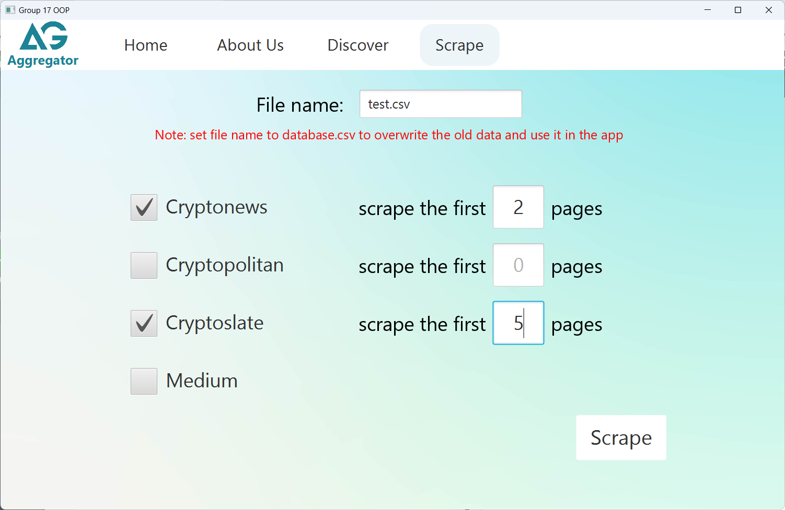

# News aggregator — Group 17


## Introduction


In the fast-paced world of blockchain technology, developers and investors need to be updated at all times.
But reading the news manually on different platforms is neither productive nor efficient.

This project is our group effort to build a `news` aggregator, making a data collection and analysis system for news
related to the blockchain field. It utilizes Java for the core system and Python for a crypto coin price prediction
component.

Our news aggregator aims to provide a lightweight app, prioritizing efficiency and ease of use without compromising
functionality.

***Disclaimer: The application is for educational purposes only. The information provided by this application,
including any price predictions for cryptocurrency, is for informational purposes only and should not be considered
financial advice. We are not responsible for any investment losses or gains you may incur as a result of using the
information provided in this application.***

## Key features

- News scraper from various blockchain-related news and blog sites using [JSoup](https://jsoup.org/) and 
[Selenium](https://www.selenium.dev/).
- Data storage in CSV format with reading to and writing from Java annotated beans, using
[opencsv](https://opencsv.sourceforge.net/).
- Interactive GUI designed using [JavaFX](https://openjfx.io/) and 
[Scene Builder](https://gluonhq.com/products/scene-builder/).
- Accurate and relevant search results using [BM25](https://en.wikipedia.org/wiki/Okapi_BM25) ranking algorithm.
- Simple implementation of autocomplete function using [Trie](https://en.wikipedia.org/wiki/Trie) data structure.
- Various cryptocurrency price predictions with data from [Yahoo Finance](https://finance.yahoo.com/), using linear
regression ~~and SVM~~. The models are implemented in Python and connected to Java by sending HTTP requests to 
[Flask](https://flask.palletsprojects.com/en/3.0.x/) applications.


## Project structure
```
└── src
    ├── java
    │   └── group17.news_aggregator
    │       ├── auto_complete
    │       ├── csv_converter
    │       ├── exception
    │       ├── gui
    │       ├── news
    │       ├── scraper
    │       └── search_engine
    ├── python
    └── resources
```


## Requirements

- Java JDK version 21 or higher.
- Python version 3.9 or higher.


## Installation and usage

First, clone this repository, and change the current working directory to this repository's root folder:

```bash
git clone https://github.com/thanh309/news-aggregator-g17.git
cd news-aggregator-g17
```

### Java

The application is already bundled into an executable JAR file with all the dependencies needed to run - you only
need to run the bundled file:
```shell
java -jar src/release/news-aggregator-g17.jar
```

### Python

Python is needed to use the price prediction function. A fresh conda environment is recommended, although you can
totally use global environment and use `pip`.

#### Conda
Make sure conda is installed on your machine. If not, follow the [instruction](https://docs.anaconda.com/free/miniconda/)
to install Miniconda.
```shell
conda create --name news-aggregator-g17 python=3.9 --yes
conda activate news-aggregator-g17
pip install -r requirements.txt
```
If you get the error `'conda' is not recognized as an internal or external command`, run the Anaconda Prompt as
administrator and run
```shell
conda update conda
conda init
```

#### Pip
If you prefer not to install conda, run
```shell
pip install -r requirements.txt
```
to install Python dependencies.

#### Running the Flask app
```shell
conda activate news-aggregator-g17
flask --app src/main/python/app.py run
```

## Building
This project uses Gradle as the build system for dependency management. We recommend using
[IntelliJ IDEA](https://www.jetbrains.com/idea/) as it supports a fully functional integration with Gradle.

To build the project, run
```shell
./gradlew build
```
in the IDE's terminal.


## Demo




## Acknowledgments
This project would not be possible if not for the great open-source libraries, such as [JSoup](https://jsoup.org/),
[Selenium](https://www.selenium.dev/) and [opencsv](https://opencsv.sourceforge.net/). We would like to express our
gratitude to our lecturer, Professor Trinh Tuan Dat for providing us with a challenging, yet highly fascinating project
assignment, which has allowed us to learn a lot and significantly broadened our skillset. We would also want to thank
our friends for their invaluable feedback and suggestions throughout the development process.


## Contributors
- Vũ Trung Thành - 20220066
- Lương Hữu Thành - 20225458
- Nguyễn Mậu Trung - 20225534
- Trần Thành Vinh - 20225539
- Đoàn Anh Vũ - 20225465

## License
This project is licensed under the [MIT License](LICENSE).